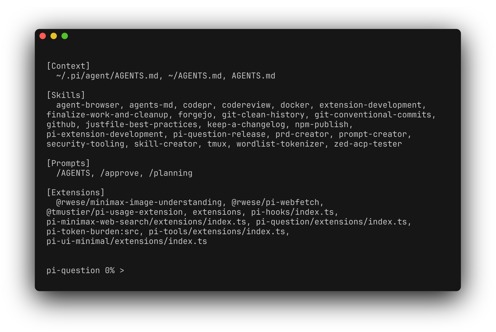
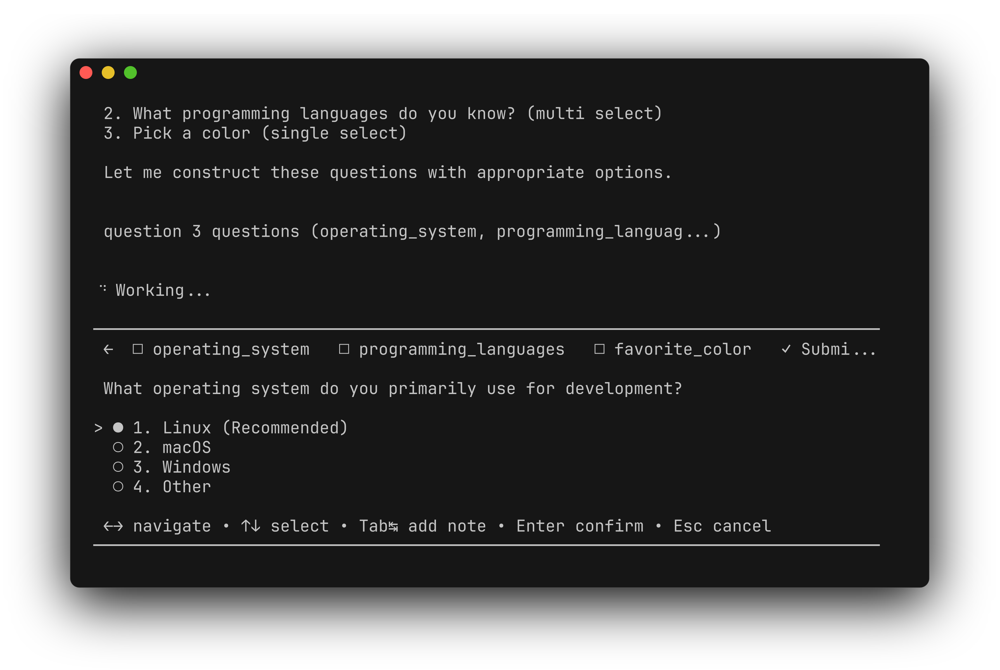
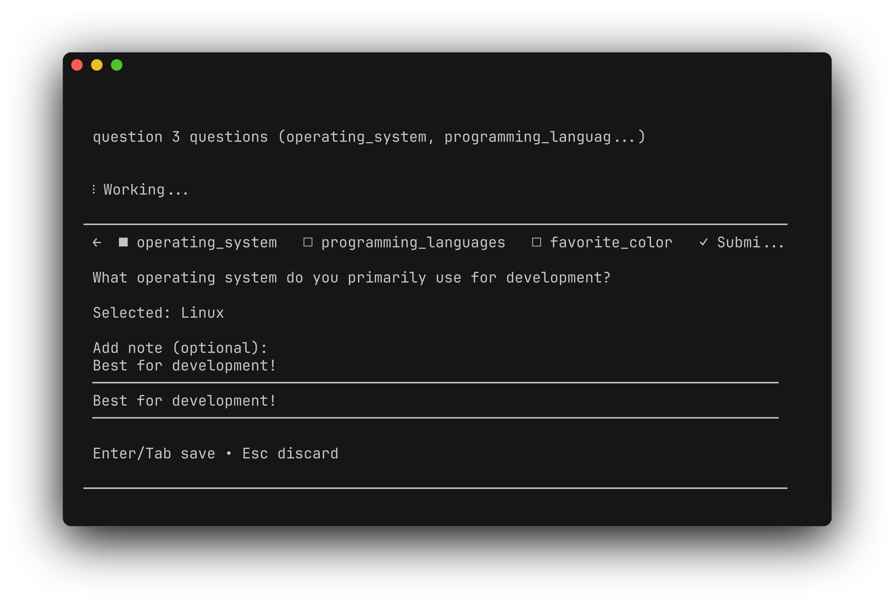
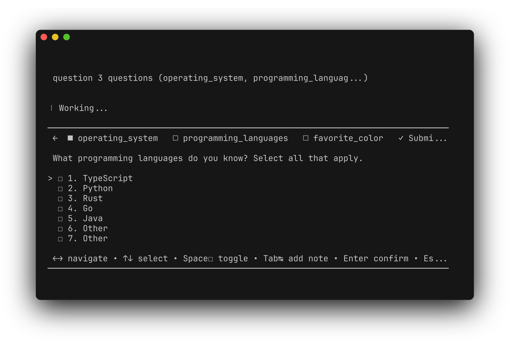
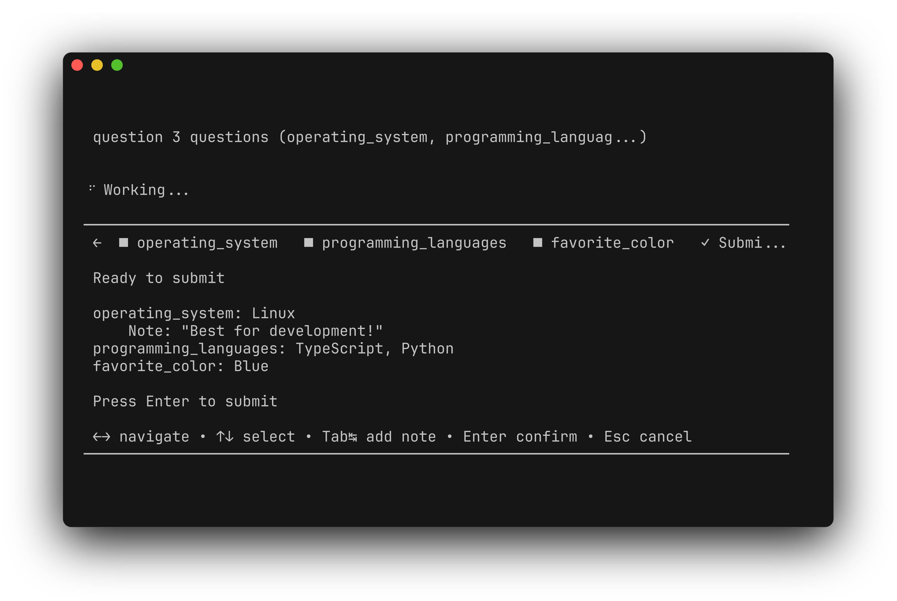

# @rwese/pi-question

[](https://www.npmjs.com/package/@rwese/pi-question)
[](LICENSE)

Unified question tool for the pi coding agent with single/multi-question support, optional notes, per-option comments, and custom input.

## Features

- **Single-select questions**: Radio-style selection with keyboard navigation
- **Multi-select questions**: Checkbox-style selection for multiple answers
- **Per-item notes**: Press (n) on any selected item to add a note (multi-select only)
- **Recommended options**: Pre-select and highlight recommended choices
- **Custom input**: "Other" option with inline text editor for free-form input
- **Multi-question support**: Tab bar interface for sequential questioning
- **Answer review**: Summary screen before final submission
- **Markdown output**: Clean markdown formatting for AI consumption
- **Auto-disable**: Tool is not registered in non-interactive mode (`--print`/`-p`)

## Installation

```bash
# From npm (recommended)
pi install npm:@rwese/pi-question

# From GitHub
pi install git:github.com/rwese/pi-question
```

After install, enable via `pi config` → User → Extensions.

## Screenshots

See [demo.md](demo.md) for full interactive demo walkthrough.

 |  | 
:---:|:---:|:---:
*Pi starting up* | *Single select* | *Tab to add note*

 |  | 
:---:|:---:|:---:
*Multi select* | *Multiple options* | *Review before submit*

## Usage

### Tool Call

```typescript
await pi.callTool("question", {
  questions: [
    {
      questionTopic: "Scope",
      prompt: "What type of change is this?",
      type: "single",
      options: [
        { value: "feat", label: "Feature" },
        { value: "fix", label: "Bug fix" },
        { value: "docs", label: "Documentation" }
      ]
    },
    {
      questionTopic: "Priority",
      prompt: "How urgent is this?",
      type: "multi",
      options: [
        { value: "high", label: "High", recommended: true },
        { value: "medium", label: "Medium" },
        { value: "low", label: "Low" }
      ]
    }
  ]
});
```

## What Gets Injected Into the Agent

After the user answers all questions, the tool returns **markdown output** that is injected into the agent's context.

### Resulting Markdown Output

The markdown is rendered inline in the agent's context, showing headers for each question and the selected answers.

### Single-Select Output

When a single-select question is answered, the output includes the question prompt followed by the selected option:

```markdown
## User answered our questions

### What type of change is this?

- **Bug fix** - Fix a bug in existing code
```

**Note:** When an option includes a `description`, it is bolded and displayed alongside the label. User notes (added via Tab) are shown with a `Note:` prefix.

### Multi-Select Output

Multi-select questions use checkbox notation (`[x]`) to show selected items. Notes added via (n) key are shown as nested bullets:

```markdown
### How urgent is this?

- [x] **High** - Needs immediate attention
- [x] Medium
  Note: Can be addressed in next sprint
```

### Full Questionnaire Output

When multiple questions are asked, all answers are included in order:

```markdown
## User answered our questions

### What type of change is this?

- **Bug fix** - Fix a bug in existing code

### How urgent is this?

- [x] **High** - Needs immediate attention
- [x] Medium
```

## Return Data Structure

The tool also returns structured data in `details` for programmatic access:

### QuestionnaireResult

```typescript
interface QuestionnaireResult {
  questions: Question[];
  answers: Answer[];
  cancelled: boolean;
}

type Answer = SingleAnswer | MultiAnswer;

interface SingleAnswer {
  value: string;       // The option value (e.g., "go", "(other)")
  label: string;       // Display label (e.g., "Go", "Custom text")
  description?: string; // Option description (if provided)
  wasCustom: boolean;  // True if user entered custom text via "Other"
  index?: number;      // 1-based position in sorted options
  message?: string;    // Optional note added via Tab
}

interface MultiAnswerItem {
  value: string;       // The option value
  label: string;       // Display label
  description?: string; // Option description (if provided)
  wasCustom: boolean;  // True if custom text entered
  note?: string;       // User-provided note (added via (n) key)
}

interface MultiAnswer {
  items: MultiAnswerItem[]; // Array of selected items with notes
}
```

### Example Return Value

```typescript
{
  content: [
    {
      type: "text",
      text: "## User answered our questions\n\n### What type of change is this?\n\n- **Bug fix** - Fix a bug in existing code\n\n### How urgent is this?\n\n- [x] **High** - Needs immediate attention\n- [x] Medium\n"
    }
  ],
  details: {
    questions: [
      { questionTopic: "Scope", prompt: "What type of change is this?", type: "single", options: [...] },
      { questionTopic: "Priority", prompt: "How urgent is this?", type: "multi", options: [...] }
    ],
    answers: [
      { value: "fix", label: "Bug fix", description: "Fix a bug in existing code", wasCustom: false, index: 2 },
      { items: [
        { value: "high", label: "High", description: "Needs immediate attention", wasCustom: false },
        { value: "medium", label: "Medium", wasCustom: false }
      ] }
    ],
    cancelled: false
  }
}
```

## UI States

### Tab Bar (Multi-Question)

When multiple questions are asked, a tab bar appears at the top:

```
▸ Language      ■ Tools      □ OS       □ Workflow     ✓ Submit →
```

- `▸` / `◂`: Navigation arrows
- `□` / `■`: Unanswered / Answered status
- `✓`: Submit tab (enabled when all questions answered)

### Single-Select (Radio)

```
  1. ● Go        Fast, compiled, concurrent
  2.   ○ Rust    Safe, fast, zero-cost abstractions
  3.   ○ TypeScript    JavaScript with types    (Recommended)
  4.   ○ Python  Simple and readable
  5.   ○ Other ✎
```

### Multi-Select (Checkbox)

```
  1. > ☑ VS Code     (Recommended)
  2.   ☐ Vim/Neovim
  3.   ☐ JetBrains IDEs
  4.   ☐ Zed
  5.   ☐ Other ✎
```

### Note Entry (Tab Key)

```
 What is your preferred language?

 Selected: Go

 Add note (optional):
  Fast compilation time

 Enter/Tab save • Esc discard
```

### Submit Review

```
 Ready to submit

  Scope: Bug fix
  Priority: High, Medium

 Press Enter to submit
```

### Cancellation

If the user presses `Esc`, the questionnaire is cancelled:

```typescript
{
  content: [{ type: "text", text: "User cancelled the question" }],
  details: { questions: [...], answers: [], cancelled: true }
}
```

A `questionnaire-cancelled` message is also sent to the agent.

## Keyboard Navigation

| Key | Action |
|-----|--------|
| `↑` / `↓` | Navigate options |
| `←` / `→` | Navigate questions (multi) |
| `Enter` | Select option + advance |
| `Space` | Toggle option selection (multi) |
| `(n)` | Add note to selected option (multi) |
| `Escape` | Cancel entire questionnaire |

## Schema

```typescript
// Question option
{
  value: string,           // Returned when selected
  label: string,            // Display label
  description?: string,    // Optional description below label
  recommended?: boolean    // Pre-select and highlight
}

// Question
{
  questionTopic: string,    // Tab bar label
  prompt: string,           // Question text
  type?: "single" | "multi", // Default: "single"
  options: QuestionOption[]
}

// Questionnaire
{
  questions: Question[]
}
```

## Special Values

| Value | Meaning |
|-------|---------|
| `(other)` | User selected "Other" and entered custom text |
| `(no choice)` | User explicitly selected "no choice" option |
| `(no selection)` | Multi-select with no options selected |

## Development

```bash
# Install dependencies
npm install

# Type check
npm run typecheck

# Lint
npm run lint

# Format
npm run format

# Test
npm test

# Coverage
npm run coverage

# Validate (all checks)
npm run validate
```

## License

MIT
