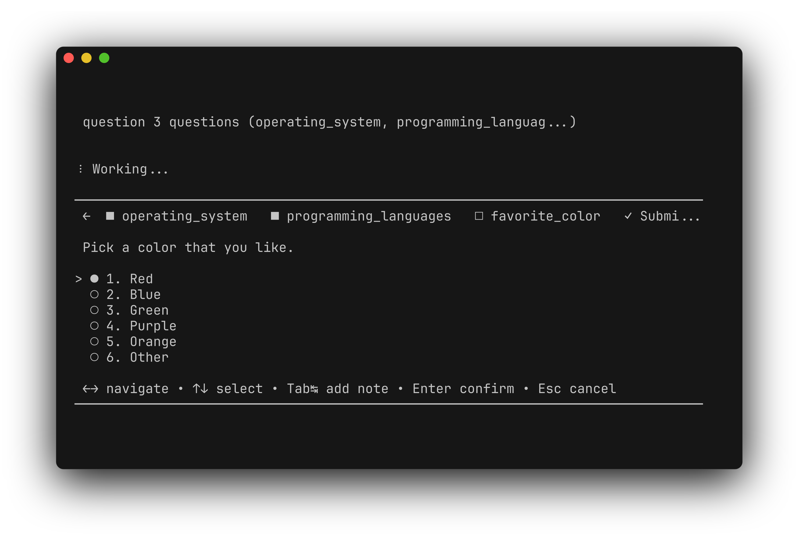
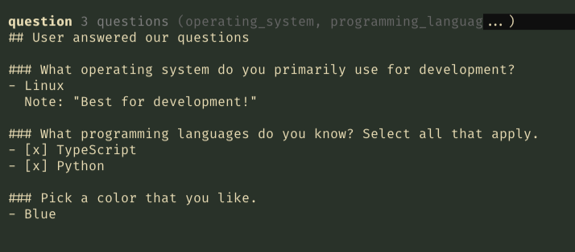

# @rwese/pi-question Demo

Interactive question tool demonstration using tmux automation.

## Flow

*Pi starting up*

*Single select with recommended option (Linux)*

*Tab to add a note*

*Multi select question*

*Multiple options selected*

*Single select (colors)*

*Summary with all answers and note*

*Agent readable markdown answers injected*
